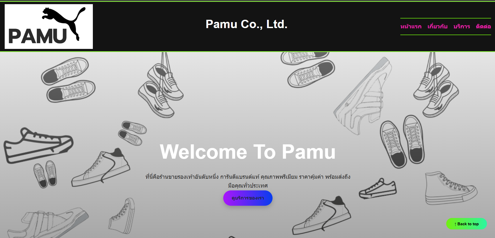
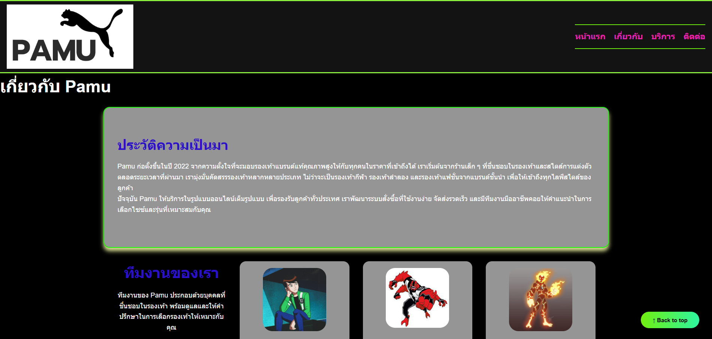
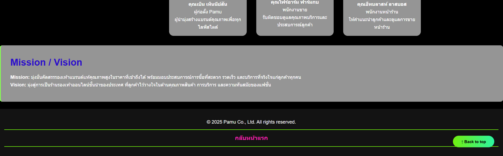
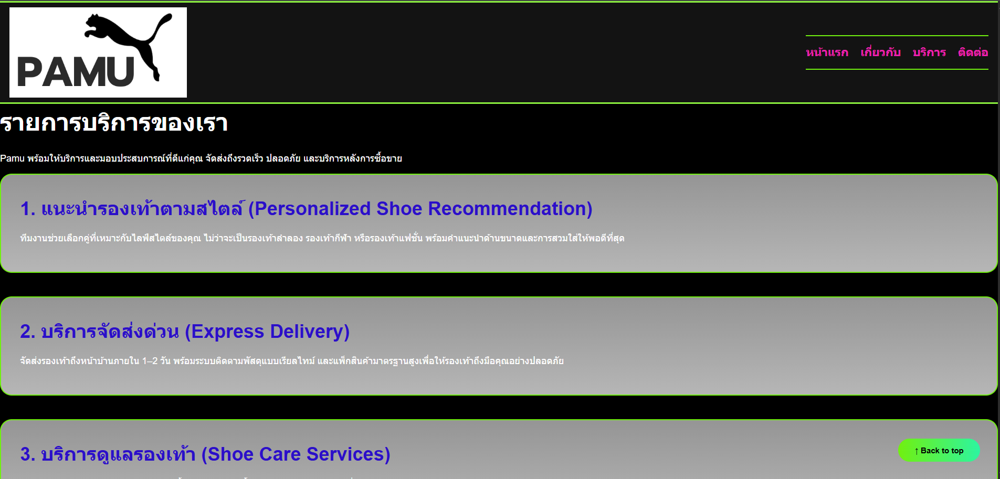
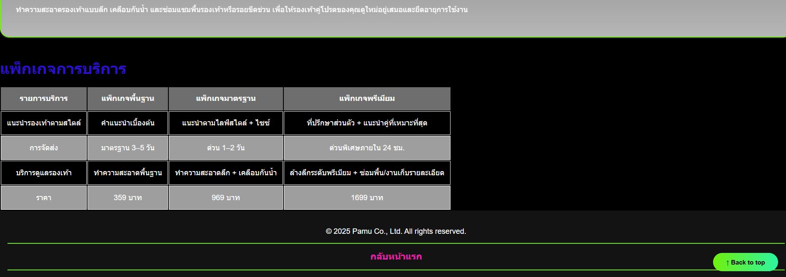
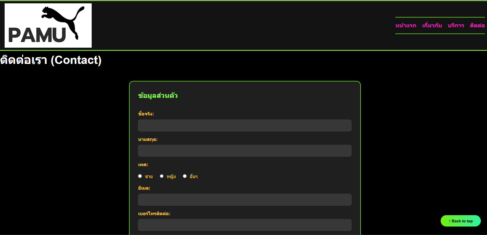
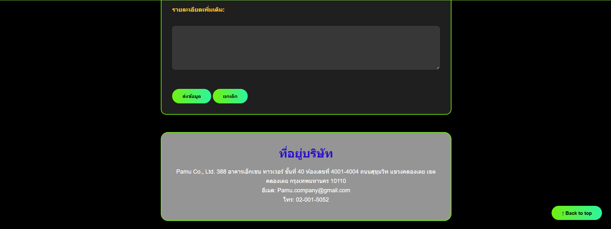
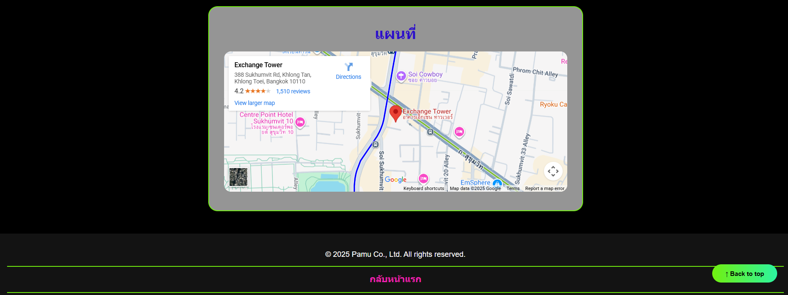

# Pamu Co., Ltd. – เว็บไซต์ร้านขายรองเท้า

เว็บไซต์จำลองของ **Pamu Co., Ltd.** สำหรับ **Assignment #1**  
เป็นเว็บไซต์ร้านขายรองเท้าออนไลน์ที่จำหน่ายรองเท้าหลากหลายสไตล์ พร้อมบริการให้คำแนะนำ ดูแลหลังการขาย และการจัดส่งที่รวดเร็ว

## รายละเอียดข้อมูล

เว็บไซต์ประกอบด้วย **4 หน้าหลัก** ดังนี้ :

1. หน้าแรก (Home)
2. เกี่ยวกับเรา (About)
3. บริการ (Services)
4. ติดต่อเรา (Contact)

## โครงสร้างไฟล์

- index.html : หน้าแรก (Home)
- about.html : หน้าเกี่ยวกับเรา (About)
- services.html : หน้าบริการ (Services)
- contact.html : หน้าติดต่อเรา (Contact)
- images/ : โฟลเดอร์เก็บรูปภาพ

  - pamu logo.png
  - member1.jpg
  - member2.jpg
  - member3.jpg
  - index1.png
  - index2.png
  - about0.1.png
  - about0.2.png
  - service1.png
  - service2.png
  - contact0.1.png
  - contact0.2.png
  - contact0.3.png

- README.md : เอกสารประกอบโปรเจกต์

## ลิงก์เข้าสู่หน้าต่างๆ

### [หน้าแรก](index.html)

### [เกี่ยวกับเรา (About)](about.html)

### [บริการของเรา (Services)](services.html)

### [ติดต่อเรา (Contact)](contact.html)

## ผู้จัดทำ

ชื่อ-นามสกุล: ชาลิสา ศรีหงษ์
รหัสนิสิต: 67160002
